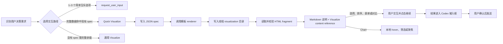

# Codex VT Quick Visualize

一套与 Codex Desktop `Visualize` 插件配合使用的可复用交互和简单图表模板。它把多选、排序、参数表单、方案对比和基础图表收敛为固定前端与 JSON spec，让 Codex 只需匹配模板、填写数据并调用 renderer。

> Quick Visualize 不是 Visualize 的替代品。模板负责稳定的结构与交互，Visualize 负责线程级 HTML surface、沙箱运行环境和消息流内呈现。

## 模板

| 模板 | 适用场景 | 数据边界 |
| --- | --- | --- |
| `Multi Select Simple` | 只有简短标题的多选 | 2–20 项 |
| `Multi Select Complete` | 标题下面还需要 supporting text 的多选 | 2–20 项 |
| `Ranker` | 拖拽或键盘调整完整优先级顺序 | 2–20 项单行文本 |
| `Parameter Form` | 一个或多个互不联动的基础设置 | 1–12 个可组合字段 |
| `Comparison` | 像订阅 Plan 一样比较多个方案并单选 | 2–4 个方案、相同的 2–8 个维度 |
| `Line Chart` | 查看单个非负指标随日期的平滑趋势 | 2–90 个日期数据点、单序列 |
| `Grouped Bar Chart` | 在共享类别和数值轴上比较多个对象 | 2–3 个序列、共同的 2–6 个类别 |
| `Donut Chart` | 查看共同组成一个整体的类别占比 | 2–6 个类目、非负数值、总和大于 0 |
| `Radar Chart` | 比较一个或多个对象在共同指标上的相对强弱 | 1–4 个对象、共同的 3–8 个维度与量表 |

`Parameter Form` 当前支持 `text`、`textarea`、`select`、`radio`、`switch`、`checkbox` 和 `range`。每一种字段都可以单独成表，也可以重复或自由组合。

`Line Chart` 使用平滑曲线、零基线渐变面积和 hover 气泡展示日期、数值及可选说明。模板不会自行推导环比或变化量。

`Grouped Bar Chart` 把 2–3 个序列放在相同类别和数值轴上并排比较，支持按图例筛选序列和按类别查看全部对象。

`Donut Chart` 自动计算总值、各类目占比和最大类目。默认中心显示最大类目及其占比，hover 时临时切换到当前类目；气泡展示原始值、占比和可选说明。

`Radar Chart` 使用低透明度填充叠加多个对象。hover 图例或数据点会临时聚焦对应对象，点击图例可锁定或取消聚焦；数据点气泡在同一个指标下并列展示全部对象的值。

## 路由与运行链



完整的模型执行步骤写在 [SKILL.md](skill/quick-visualize/SKILL.md)。各模板的 JSON schema 位于 [`references/`](skill/quick-visualize/references/)。

## 前置条件

### 1. Codex Desktop 与 Visualize 插件

必须安装并启用 OpenAI bundled `Visualize` 插件。在当前可用的 Codex Desktop 配置中，对应条目是：

```toml
[plugins."visualize@openai-bundled"]
enabled = true
```

如果你的 Codex 版本提供 Plugins 界面，优先从界面安装或启用；不要仅靠手写配置假设插件已经存在。插件版本和配置键可能随 Codex 更新而变化。

### 2. Python 3

模板 renderer 使用 Python 标准库，不需要额外的 pip 或 npm 依赖。

```bash
python3 --version
```

### 3. 推荐：在 Default mode 开启 `request_user_input`

这不是 Quick Visualize 的硬依赖，但它能组成完整路由：简单互斥问题走原生快速选择，命中现有 spec 的请求走 Quick Visualize。

在现有 `[features]` 下添加这一项；如果该 section 已存在，不要重复创建：

```toml
[features]
default_mode_request_user_input = true
```

修改插件或 feature 配置后，重启 Codex Desktop。

## 安装

默认安装目录是 `${CODEX_HOME}/skills`；未设置 `CODEX_HOME` 时通常是 `~/.codex/skills`。

### 使用 Codex 自带 Skill Installer

```bash
python3 ~/.codex/skills/.system/skill-installer/scripts/install-skill-from-github.py \
  --repo Vontean/Codex-VT-Quick-Visualize \
  --path skill/quick-visualize
```

Installer 在目标目录已经存在同名技能时会停止。更新前请先备份或移走旧的 `quick-visualize` 目录。

### 手动安装

```bash
git clone https://github.com/Vontean/Codex-VT-Quick-Visualize.git
mkdir -p ~/.codex/skills
cp -R Codex-VT-Quick-Visualize/skill/quick-visualize ~/.codex/skills/
```

安装或更新后重启 Codex Desktop；技能会在下一次任务中被发现。

## 推荐的 `AGENTS.md` 路由

把 [AGENTS.example.md](AGENTS.example.md) 中的路由规则合并到用户级 `~/.codex/AGENTS.md`，或放进需要该行为的项目级 `AGENTS.md`。

## 使用

技能可以由路由规则自动触发，也可以显式调用：

```text
使用 $quick-visualize；完整数据与交互命中现有 spec 时使用对应模板，否则改用通用 Visualize。
```

## Composer handoff

模板中的 `继续` 会调用 Visualize 插件当前的确认契约：

```js
await window.openai.sendFollowUpMessage({ prompt, title })
```

`title` 是确认对话框的短标题（1–250 字符），来自 spec 的可选 `follow_up_title` 字段；spec 未提供时模板省略该字段。

当前 Codex Desktop 的行为是把生成结果放进输入框，等待用户检查和手动发送；它不会绕过用户直接发送消息。技能刻意保留这个确认步骤，也不会尝试从 visualization sandbox 操作父级输入框。

四种 Chart 只提供本地 hover、图例筛选或聚焦，不调用 composer handoff。

## 仓库结构

```text
.
├── README.md
├── AGENTS.example.md
├── LICENSE
└── skill/
    └── quick-visualize/
        ├── SKILL.md
        ├── agents/openai.yaml
        ├── assets/
        ├── references/
        └── scripts/
```

- `assets/`：稳定的 HTML fragment 模板。
- `scripts/`：读取 JSON spec 并渲染模板的 Python 脚本。
- `references/`：按模板按需加载的 schema 与边界。
- `agents/openai.yaml`：Codex 技能列表中的显示名称、简述和默认提示词。

### 分发包与运行路径

Skill 源码只使用可移植的相对路径；运行时 spec、HTML 和截图不进入分发包。调用方应使用当前任务提供的 visualization 目录和 renderer 返回的实际路径，禁止写死开发机目录。

## 开发与验证

验证技能结构：

```bash
python3 ~/.codex/skills/.system/skill-creator/scripts/quick_validate.py \
  skill/quick-visualize
```

检查所有 renderer 的 Python 语法：

```bash
python3 -m py_compile skill/quick-visualize/scripts/*.py
```

渲染一个 spec：

```bash
python3 skill/quick-visualize/scripts/render_comparison.py \
  /path/to/spec.json \
  /path/to/thread-visualization-directory/comparison.html
```

生成后应检查：

- 问题、标签、维度、默认状态和顺序与 spec 一致。
- HTML 中没有未替换的 `{{...}}` token。
- JavaScript 可以解析，主要交互能更新选择、顺序或图表状态。
- 最终消息先输出必要的普通 Markdown，再单独输出 Visualize content reference；直接使用 renderer 在当次任务中返回的实际输出路径，不拼接或写死开发机目录。
- content reference 是包含私有区边界字符（U+E200 / U+E202 / U+E201）的客户端 token，不是纯文本；手写或复制时丢失这三个不可见字符会让客户端把整行当作字面文本渲染。以当前安装的 Visualize SKILL.md 中的原始 token 为准。

## 有意保留的边界

- 不为单次问题修改模板前端；只替换 JSON spec。
- 不把超出任一现有 spec 承载能力的数据或交互强行塞进模板。
- 不自动发送用户消息。
- 不自动安装或修改 Visualize 插件。
- 不自动修改用户的 `config.toml` 或 `AGENTS.md`。

## License

[MIT](LICENSE)
