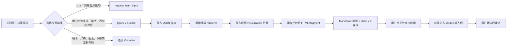

# Codex VT Quick Visualize

一套与 Codex Desktop `Visualize` 插件配合使用的可复用交互模板。它把高频的多选、排序、参数表单和方案对比收敛为固定前端与 JSON spec，让 Codex 只需要识别需求、填入数据并调用 renderer，而不必为每次提问重新生成整套界面。

> Quick Visualize 不是 Visualize 的替代品。模板负责稳定的结构与交互，Visualize 负责线程级 HTML surface、沙箱运行环境和消息流内呈现。

## 模板

| 模板 | 适用场景 | 数据边界 |
| --- | --- | --- |
| `Multi Select Simple` | 只有简短标题的多选 | 2–20 项 |
| `Multi Select Complete` | 标题下面还需要 supporting text 的多选 | 2–20 项 |
| `Ranker` | 拖拽或键盘调整完整优先级顺序 | 2–20 项单行文本 |
| `Parameter Form` | 一个或多个互不联动的基础设置 | 1–12 个可组合字段 |
| `Comparison` | 像订阅 Plan 一样比较多个方案并单选 | 2–4 个方案、相同的 2–8 个维度 |

`Parameter Form` 当前支持 `text`、`textarea`、`select`、`radio`、`switch`、`checkbox` 和 `range`。每一种字段都可以单独成表，也可以重复或自由组合。

## 路由与运行链



完整的模型执行步骤写在 [SKILL.md](skill/quick-visualize/SKILL.md)。各模板的 JSON schema 位于 [`references/`](skill/quick-visualize/references/)。

## 前置条件

### 1. Codex Desktop 与 Visualize 插件

必须安装并启用 OpenAI bundled `Visualize` 插件。在当前可用的 Codex Desktop 配置中，对应条目是：

```toml
[plugins."visualize@openai-bundled"]
enabled = true
```

如果你的 Codex 版本提供 Plugins 界面，优先从界面安装或启用；不要仅靠手写配置假设插件已经存在。插件版本和配置键可能随 Codex 更新而变化。

### 2. Python 3

模板 renderer 使用 Python 标准库，不需要额外的 pip 或 npm 依赖。

```bash
python3 --version
```

### 3. 推荐：在 Default mode 开启 `request_user_input`

这不是 Quick Visualize 的硬依赖，但它能组成完整的两级提问路由：简单互斥问题走原生快速选择，复杂的多选、排序、表单和对比再走 Quick Visualize。

在现有 `[features]` 下添加这一项；如果该 section 已存在，不要重复创建：

```toml
[features]
default_mode_request_user_input = true
```

修改插件或 feature 配置后，重启 Codex Desktop。

## 安装

默认安装目录是 `${CODEX_HOME}/skills`；未设置 `CODEX_HOME` 时通常是 `~/.codex/skills`。

### 使用 Codex 自带 Skill Installer

```bash
python3 ~/.codex/skills/.system/skill-installer/scripts/install-skill-from-github.py \
  --repo Vontean/Codex-VT-Quick-Visualize \
  --path skill/quick-visualize
```

Installer 在目标目录已经存在同名技能时会停止。更新前请先备份或移走旧的 `quick-visualize` 目录。

### 手动安装

```bash
git clone https://github.com/Vontean/Codex-VT-Quick-Visualize.git
mkdir -p ~/.codex/skills
cp -R Codex-VT-Quick-Visualize/skill/quick-visualize ~/.codex/skills/
```

安装或更新后重启 Codex Desktop；技能会在下一次任务中被发现。

## 推荐的 `AGENTS.md` 路由

把下面两行合并到用户级 `~/.codex/AGENTS.md`，或放进需要该行为的项目级 `AGENTS.md`：

```md
- 1–3 个简单且互斥的选择优先使用 `request_user_input`；多选、拖拽排序、独立参数表单或共享维度方案对比使用 `$quick-visualize`；联动参数、异构布局、图表或模拟使用通用 `Visualize`。
- `$quick-visualize` 按“识别模板 → 写 JSON spec → renderer 写入线程 visualization 目录 → 读取校验 → Markdown 提问 + inline-vis 呈现”执行；`继续` 只把结果写入输入框，由用户确认发送。
```

同样的片段也保存在 [AGENTS.example.md](AGENTS.example.md)。

## 使用

技能可以由路由规则自动触发，也可以显式调用：

```text
使用 $quick-visualize，让我从这些候选项中多选，并为每项显示一行说明。
```

```text
使用 $quick-visualize，把这些任务做成可拖拽排序，然后让我继续提交顺序。
```

```text
使用 $quick-visualize，用 Parameter Form 收集输出目录、格式、自动保存和详细程度。
```

```text
使用 $quick-visualize，用 Comparison 对比三个方案的价格、范围、协作和支持方式，并让我单选。
```

## Composer handoff

模板中的 `继续` 会调用：

```js
await window.openai.sendFollowUpMessage({ prompt })
```

当前 Codex Desktop 的行为是把生成结果放进输入框，等待用户检查和手动发送；它不会绕过用户直接发送消息。技能刻意保留这个确认步骤，也不会尝试从 visualization sandbox 操作父级输入框。

## 仓库结构

```text
.
├── README.md
├── AGENTS.example.md
├── LICENSE
└── skill/
    └── quick-visualize/
        ├── SKILL.md
        ├── agents/openai.yaml
        ├── assets/
        ├── references/
        └── scripts/
```

- `assets/`：稳定的 HTML fragment 模板。
- `scripts/`：读取 JSON spec 并渲染模板的 Python 脚本。
- `references/`：按模板按需加载的 schema 与边界。
- `agents/openai.yaml`：Codex 技能列表中的显示名称、简述和默认提示词。

## 开发与验证

验证技能结构：

```bash
python3 ~/.codex/skills/.system/skill-creator/scripts/quick_validate.py \
  skill/quick-visualize
```

检查所有 renderer 的 Python 语法：

```bash
python3 -m py_compile skill/quick-visualize/scripts/*.py
```

渲染一个 spec：

```bash
python3 skill/quick-visualize/scripts/render_comparison.py \
  /path/to/spec.json \
  /path/to/thread-visualization-directory/comparison.html
```

生成后应检查：

- 问题、标签、维度、默认状态和顺序与 spec 一致。
- HTML 中没有未替换的 `{{...}}` token。
- JavaScript 可以解析，主要交互能更新选择或顺序。
- 最终消息先输出普通 Markdown 问题，再单独输出 `::codex-inline-vis{file="comparison.html"}`。

## 有意保留的边界

- 不为单次问题修改模板前端；只替换 JSON spec。
- 不处理字段联动、条件显隐、异构方案或完全定制布局；这些交给通用 Visualize。
- 不自动发送用户消息。
- 不自动安装或修改 Visualize 插件。
- 不自动修改用户的 `config.toml` 或 `AGENTS.md`。

## License

[MIT](LICENSE)
