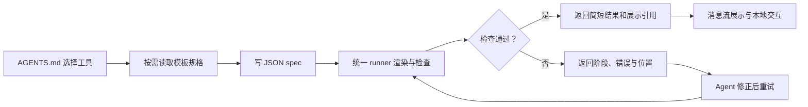

# Codex VT Quick Visualize

一套与 Codex Desktop `Visualize` 插件配合使用的可复用交互和简单图表模板。它把多选、排序、参数表单、方案对比和基础图表收敛为固定前端与 JSON spec，让 Codex 只需匹配模板、填写数据并调用 renderer。

> Quick Visualize 不是 Visualize 的替代品。模板负责稳定的结构与交互，Visualize 负责线程级 HTML surface、沙箱运行环境和消息流内呈现。

## 模板

| 模板 | 适用场景 | 数据边界 |
| --- | --- | --- |
| `Multi Select Simple` | 只有简短标题的多选 | 2–20 项 |
| `Multi Select Complete` | 标题下面还需要 supporting text 的多选 | 2–20 项 |
| `Ranker` | 拖拽或键盘调整完整优先级顺序 | 2–20 项单行文本 |
| `Parameter Form` | 一个或多个互不联动的基础设置 | 1–12 个可组合字段 |
| `Comparison` | 像订阅 Plan 一样比较多个方案并单选 | 2–4 个方案、相同的 2–8 个维度 |
| `Line Chart` | 查看单个非负指标随日期的平滑趋势 | 2–90 个日期数据点、单序列 |
| `Grouped Bar Chart` | 在共享类别和数值轴上比较多个对象 | 2–4 个序列、共同的 2–6 个类别 |
| `Donut Chart` | 查看共同组成一个整体的类别占比 | 2–6 个类目、非负数值、总和大于 0 |
| `Radar Chart` | 比较一个或多个对象在共同指标上的相对强弱 | 1–4 个对象、共同的 3–8 个维度与量表 |

`Parameter Form` 当前支持 `text`、`textarea`、`select`、`radio`、`switch`、`checkbox` 和 `range`。每一种字段都可以单独成表，也可以重复或自由组合。

`Line Chart` 使用平滑曲线、零基线渐变面积和 hover 气泡展示日期、数值及可选说明。模板不会自行推导环比或变化量。

`Grouped Bar Chart` 把 2–4 个序列放在相同类别和数值轴上并排比较，支持按图例筛选序列和按类别查看全部对象。

`Donut Chart` 自动计算总值、各类目占比和最大类目。默认中心显示总量，hover 时临时切换到当前类目及其占比；气泡展示原始值、占比和可选说明。

`Radar Chart` 使用低透明度填充叠加多个对象。hover 图例临时聚焦对象；悬停轴线比较同维度的全部对象，悬停点或多边形查看单对象的全部维度，不锁定。浮窗优先贴近光标并减少遮挡。

四类图表统一采用顶部 32px 留白、标题到图表 32px 间距和居中底部图例。入场动效在离开后重新进入视野时重播，遵循减少动态效果设置。环形图在少类别且空间充足时直接标注名称与占比。详细设计约定见 [DESIGN.md](DESIGN.md)。

## 路由与运行链


```mermaid
flowchart LR
    A["AGENTS.md 选择工具"] --> B["按需读取模板规格"]
    B --> C["写 JSON spec"]
    C --> D["统一 runner 渲染与检查"]
    D --> E{"检查通过？"}
    E -->|"是"| F["返回简短结果和展示引用"]
    E -->|"否"| G["返回阶段、错误与位置"]
    G --> H["Agent 修正后重试"]
    H --> D
    F --> I["消息流展示与本地交互"]
```

完整的模型执行步骤写在 [SKILL.md](skill/quick-visualize/SKILL.md)。各模板的 JSON schema 位于 [`references/`](skill/quick-visualize/references/)。

## 前置条件

### 1. Codex Desktop 与 Visualize 插件

必须安装并启用 OpenAI bundled `Visualize` 插件。在当前可用的 Codex Desktop 配置中，对应条目是：

```toml
[plugins."visualize@openai-bundled"]
enabled = true
```

如果你的 Codex 版本提供 Plugins 界面，优先从界面安装或启用；不要仅靠手写配置假设插件已经存在。插件版本和配置键可能随 Codex 更新而变化。

### 2. Python 3

模板 renderer 使用 Python 标准库；统一 runner 还需要 PATH 中的 Node.js，通过 `node --check` 检查 JavaScript。无需 pip 或 npm 包。

```bash
python3 --version
node --version
```

### 3. 推荐：在 Default mode 开启 `request_user_input`

这不是 Quick Visualize 的硬依赖，但它能组成完整路由：简单互斥问题走原生快速选择，命中现有 spec 的请求走 Quick Visualize。

在现有 `[features]` 下添加这一项；如果该 section 已存在，不要重复创建：

```toml
[features]
default_mode_request_user_input = true
```

修改插件或 feature 配置后，重启 Codex Desktop。

## 安装

默认安装目录是 `${CODEX_HOME}/skills`；未设置 `CODEX_HOME` 时通常是 `~/.codex/skills`。

### 使用 Codex 自带 Skill Installer

```bash
python3 ~/.codex/skills/.system/skill-installer/scripts/install-skill-from-github.py \
  --repo Vontean/Codex-VT-Quick-Visualize \
  --path skill/quick-visualize
```

Installer 在目标目录已经存在同名技能时会停止。更新前请先备份或移走旧的 `quick-visualize` 目录。

### 手动安装

```bash
git clone https://github.com/Vontean/Codex-VT-Quick-Visualize.git
mkdir -p ~/.codex/skills
cp -R Codex-VT-Quick-Visualize/skill/quick-visualize ~/.codex/skills/
```

安装或更新后重启 Codex Desktop；技能会在下一次任务中被发现。

## 推荐的 `AGENTS.md` 路由

把 [AGENTS.example.md](AGENTS.example.md) 中的路由规则合并到用户级 `~/.codex/AGENTS.md`，或放进需要该行为的项目级 `AGENTS.md`。

## 使用

技能可以由路由规则自动触发，也可以显式调用：

```text
使用 $quick-visualize；完整数据与交互命中现有 spec 时使用对应模板，否则改用通用 Visualize。
```

## Composer handoff

模板中的 `Confirm` 会调用 Visualize 插件当前的确认契约：

```js
await window.openai.sendFollowUpMessage({ prompt, title })
```

`title` 是确认对话框的短标题（1–250 字符），来自 spec 的可选 `follow_up_title` 字段；spec 未提供时模板省略该字段。

当前 Codex Desktop 的行为是把生成结果放进输入框，等待用户检查和手动发送；它不会绕过用户直接发送消息。技能刻意保留这个确认步骤，也不会尝试从 visualization sandbox 操作父级输入框。

四种 Chart 只提供本地 hover、图例筛选或聚焦，不调用 composer handoff。

## 跟随宿主主题色

模板沿用 Visualize 的语义 token 和基础控件样式，不另外复制或覆盖宿主主题。

当前 App 的运行时桥把 `--app-color-text-accent` 映射为 `--primary` 和 `--viz-series-1`。这是按主题与对比度调整的文字强调色，可能比用户选择的基础色更深或更浅。原始 `--codex-base-accent` 尚未包含在传入沙箱的 `visualizationStyleVariables` 中；精确匹配基础色需要修改宿主桥接，模板不能读取父页面 CSS。

模拟主题测试只能验证颜色应用，不能证明真实宿主已传入用户选择的基础色。消息流验收应核对实际传入值及计算样式。

## 仓库结构

```text
.
├── README.md
├── AGENTS.example.md
├── LICENSE
└── skill/
    └── quick-visualize/
        ├── SKILL.md
        ├── agents/openai.yaml
        ├── assets/
        ├── references/
        └── scripts/
```

- `assets/`：稳定的 HTML fragment 模板。
- `scripts/`：读取 JSON spec 并渲染模板的 Python 脚本。
- `references/`：按模板按需加载的 schema 与边界。
- `agents/openai.yaml`：Codex 技能列表中的显示名称、简述和默认提示词。

### 分发包与运行路径

Skill 源码只使用可移植的相对路径；运行时 spec、HTML 和截图不进入分发包。调用方应使用当前任务提供的 visualization 目录和 renderer 返回的实际路径，禁止写死开发机目录。

## 开发与验证

验证技能结构：

```bash
python3 ~/.codex/skills/.system/skill-creator/scripts/quick_validate.py \
  skill/quick-visualize
```

检查所有 renderer 的 Python 语法：

```bash
python3 -m py_compile skill/quick-visualize/scripts/*.py
```

渲染一个 spec：

```bash
python3 skill/quick-visualize/scripts/render.py comparison \
  /path/to/spec.json \
  /path/to/thread-visualization-directory/comparison.html
```

统一入口在写入前检查数据规格、未替换占位符、重复或缺失的元素引用、JavaScript 语法和文件大小。正常返回 `ok: true`、实际路径、检查项目与可直接复制的 `reference`；agent 无需读取生成 HTML，也无需为固定预设加载完整 Visualize 技能。异常返回 `ok: false`、阶段、错误消息和可用的行号，退出码非零；已有输出不会被覆盖，不能沿用旧文件展示。外部脚本加载和真实布局、交互需在模板开发或疑似故障时用浏览器验收。

旧的单模板 renderer 保留作为底层生成器和兼容入口，不执行统一检查；技能调用统一使用 `scripts/render.py`。

运行回归检查：

```bash
python3 -m unittest discover -s tests -v
```

## 有意保留的边界

- 不为单次问题修改模板前端；只替换 JSON spec。
- 不把超出任一现有 spec 承载能力的数据或交互强行塞进模板。
- 不自动发送用户消息。
- 不自动安装或修改 Visualize 插件。
- 技能调用不修改用户的 `config.toml` 或 `AGENTS.md`；路由规则由用户级或项目级 `AGENTS.md` 维护。

## License

[MIT](LICENSE)
